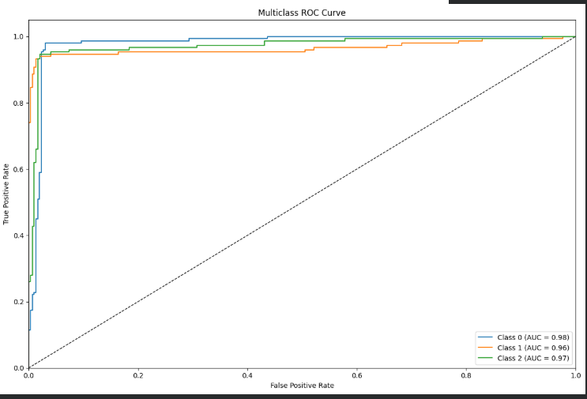
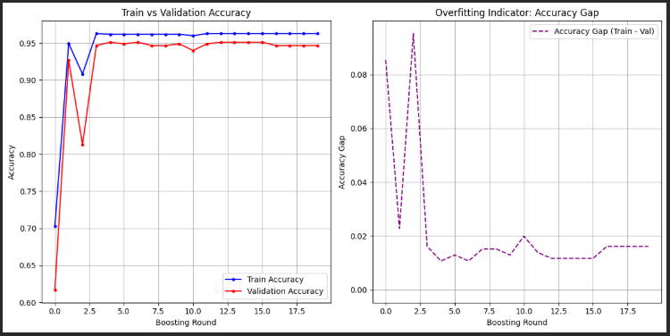

# Recommendation_Behavioral_Systems
# 🌟 Project Title — Professional AI / DSP / Embedded Project

## 📖 Overview
A short description of the project:
- What it does  
- What problem it solves  
- Who benefits from it  
- What technologies were used  

This project demonstrates an end-to-end solution using **AI + Engineering** with clean modular code and professional documentation.

---

## 🚀 Features
✔ High accuracy  
✔ Modular architecture  
✔ Easy to extend  
✔ Clean and optimized code  
✔ Well-documented  
✔ Reproducible experiments  

---

## 🛠️ Tech Stack
| Category | Technologies |
|---------|--------------|
| Programming | Python, C, Java, MATLAB |
| AI/ML | NumPy, Pandas, Scikit-Learn, TensorFlow, PyTorch |
| DSP | FFT, Filters, MATLAB Tools |
| Deployment | Flask / FastAPI |
| Tools | Git, Colab, Kaggle, Linux |

---

## 📂 Repository Structure
# 🌟 Recommendation_Behavioral_Systems

## 📊 Model Evaluation & Visualizations

### 1️⃣ Correlation Matrix
Visualizing feature correlations to understand relationships in the dataset.  

---

### 2️⃣ ROC Curve
Receiver Operating Characteristic curve showing model classification performance.  

---

### 3️⃣ Confusion Matrix
Performance evaluation of the classification model on test data.  

---

### 4️⃣ Training vs. Validation Accuracy
Shows model performance and checks for overfitting/underfitting.  

